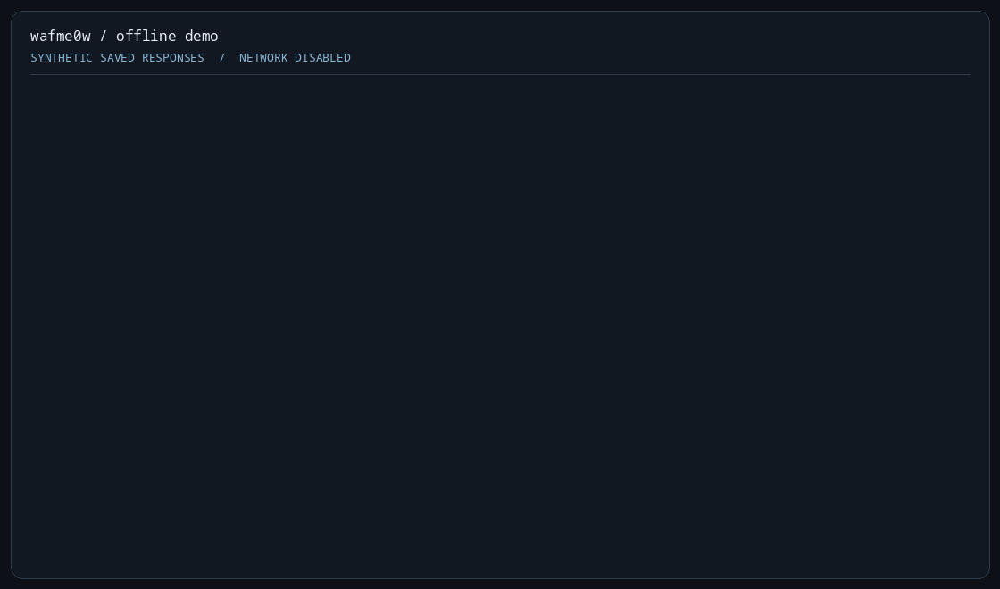

<p align="center">
  
</p>

<h1 align="center">Wafme0w</h1>

<p align="center">Blazingfast, lightweight and AI Assisted WAF detector.</p>

<p align="center">
  <a href="go.mod">Go 1.26+</a> &nbsp;·&nbsp;
  <a href="#overview">172 products</a> &nbsp;·&nbsp;
  <a href="LICENSE.md">MIT license</a>
</p>

<p align="center">
  <a href="#installation">Installation</a> &nbsp;·&nbsp;
  <a href="#usage">Usage</a> &nbsp;·&nbsp;
  <a href="#benchmarks">Benchmarks</a> &nbsp;·&nbsp;
  <a href="#go-library">Go library</a>
</p>

<p align="center"><small>AI-assisted development. Detection uses deterministic fingerprints, not an AI model.</small></p>

---

## Offline demo

Three synthetic saved responses, zero network requests: a named match, a clean no-match, and a truncated response that still supports a header match. This demonstrates result handling, not detection accuracy against deployed WAFs.



Recorded from a development build. Typing and pauses are paced for readability, not a speed benchmark.

Run the same example from an extracted release archive or this checkout:

```sh
wafme0w --evidence assets/demo/captures.jsonl
wafme0w --evidence assets/demo/captures.jsonl --jsonl
```

[Synthetic captures](assets/demo/captures.jsonl) · [Text transcript](assets/demo/transcript.txt) · [Replayable terminal recording](assets/demo/demo.cast)

## Overview

Wafme0w identifies web application firewall fingerprints in HTTP responses. Built in Go with signatures sourced from [wafw00f](https://github.com/EnableSecurity/wafw00f/), it pairs concurrent collection with clear, structured results.

Use it from your terminal, feed results into your scripts, or bring the same matcher into a Go application. Already have saved responses? Analyze them offline without sending another request.

| What you need | What Wafme0w offers |
| --- | --- |
| **Recognize WAF fingerprints** | A bundled catalogue covering 172 products |
| **Stay in control** | Configurable concurrency, request budgets and redirect scope |
| **Work with your tools** | JSONL, JSON, CSV and TXT output for scripts and reports |
| **Revisit saved responses** | Offline analysis with zero network requests |
| **Build with Go** | A reusable, concurrency-safe compiled matcher |

> **Know what a match means:** Fingerprints are clues, not proof of active WAF enforcement. An incomplete result is not a clean negative. Only assess systems you own or are authorized to test.

<details>
<summary><strong>Catalogue provenance and matching semantics</strong></summary>

The bundled catalogue is historical data with a scoped refresh against wafw00f 2.4.2, not a guarantee of current detection coverage. Its [original conversion script](https://gist.github.com/Lu1sDV/56b23fb96632df1bb6b163d088a7ef11) is reference material. The JSON rules are a declarative subset, **not a lossless conversion of all wafw00f Python-plugin behavior**: arbitrary Python control flow, response-role selection and request strategies are not preserved by this format. The refresh adds 15 missing products, updates the Azion/SiteGuard names and corrects reviewed signature/schema drift; it does not implement a general plugin converter or expand active probes.

Of the 518 bundled fingerprints, **277 use literal string matching**, **17 compare integer status codes**, and **224 retain regular expressions compiled once by `Compile`**. Regex-derived literal matching preserves anchors and Unicode case folding. The five `Reason` fingerprints now use **exact, case-sensitive literal equality**: custom catalogues must supply the actual reason phrase, not regex anchors or flags. Other complex expressions keep Go regexp semantics, with malformed fingerprints rejected before execution.

</details>

## Installation
Download a tested binary from [v0.3.1](https://github.com/Lu1sDV/wafme0w/releases/tag/v0.3.1); no Go installation is needed:

| Platform | Archive |
| --- | --- |
| Linux x64 | [tar.gz](https://github.com/Lu1sDV/wafme0w/releases/download/v0.3.1/wafme0w_v0.3.1_linux_amd64.tar.gz) |
| macOS Apple silicon | [tar.gz](https://github.com/Lu1sDV/wafme0w/releases/download/v0.3.1/wafme0w_v0.3.1_darwin_arm64.tar.gz) |
| Windows x64 | [zip](https://github.com/Lu1sDV/wafme0w/releases/download/v0.3.1/wafme0w_v0.3.1_windows_amd64.zip) |

Check the archive's SHA-256 against [SHA256SUMS](https://github.com/Lu1sDV/wafme0w/releases/download/v0.3.1/SHA256SUMS), extract it, and put `wafme0w` (`wafme0w.exe` on Windows) on your `PATH`. Archives include the synthetic demo captures under `assets/demo/`.

### Install with Go

Building from source requires **Go >= 1.26**. To install the latest published version:

```sh
go install -v github.com/Lu1sDV/wafme0w/cmd/wafme0w@latest
```

To build this checkout instead:

```sh
go build -o wafme0w ./cmd/wafme0w
```

### Docker

<details>
<summary>Build and inspect the container without networking</summary>

The image builds the local checkout with Go 1.27, then copies the static binary and CA certificates into a minimal runtime image.

```sh
git clone https://github.com/Lu1sDV/wafme0w.git
cd wafme0w
docker build -t wafme0w:latest .
```

Inspect the container without sending requests:

```sh
docker run --rm --network none wafme0w:latest --help
docker run --rm --network none wafme0w:latest --silent --list --no-colors
```

</details>

## Usage

Inspect the CLI or list the bundled catalogue without sending requests:

```sh
wafme0w --help
wafme0w --silent --list --no-colors
```

### Collection modes

| Mode | Network behavior |
| --- | --- |
| Default / `--fast` | Active requests; fast mode reduces the request set, but is **not passive** |
| `--baseline` | Only the normal request, subject to redirect and request budgets |
| `--evidence captures.jsonl` | Classifies saved observations with **zero network access**; `-` reads stdin |

<details>
<summary><strong>Saved-capture format and replay</strong></summary>

Capture files contain one JSON object per line; body bytes use standard JSON base64 encoding:

```json
{"target":"saved-origin","evidence":[{"role":"Normal","status_code":200,"reason":"OK","headers":[],"body":"b3JkaW5hcnk="}]}
```

```sh
wafme0w --evidence captures.jsonl --jsonl --strict
```

Capture labels are identifiers, not destinations to request. Bare labels have an empty `origin`; valid HTTP(S) URL labels can carry their normalized origin. Each record is limited to 16 MiB, 64 observations, 4,096 header values per observation and the configured decoded-body limit. Unknown fields or malformed records stop the stream; earlier emitted results remain available.

</details>

### Inputs and limits

| Setting | Behavior |
| --- | --- |
| URL input precedence | `--input`, then `--target`, then stdin; blank lines ignored |
| Target line size | Go's 64 KiB scanner token limit |
| Catalogue size | At most 8 MiB; one JSON array with known fields and valid HTTP header names |
| Concurrency | `--concurrency` defaults to 20 and must be positive |
| Response body size | `--max-body-bytes` defaults to 1,048,576 decoded bytes and must be positive |
| Request / target deadlines | `--request-timeout` defaults to 5s; `--target-timeout` to 30s |
| Requests per target | `--max-requests` defaults to 54, including redirects |
| Globally in-flight requests | `--max-connections` defaults to 20, including body reads |
| Redirect limit | `--max-redirects` defaults to 5 per request; 0 follows none |

Bodies are bounded after gzip/deflate decoding. Unsupported encodings, truncation and read errors retain usable response metadata without treating unavailable content as a clean negative. The ineffective `-H`/`--headers` option remains removed.

<details>
<summary><strong>URL validation, redirect scope and pacing</strong></summary>

URLs retain path/query case and escapes. Results preserve the input target separately from the normalized origin and effective response URL. Only HTTP(S) URLs and scheme-less ASCII DNS/IP hosts are accepted; credentials, fragments, invalid ports and malformed escapes are rejected.

Redirects default to `--redirect-policy canonical-host`: the starting origin and its exact `www`/non-`www` counterpart, with the same scheme and effective port. Paths and queries may change; other subdomains, different domains, scheme/port changes and expanding `www` chains remain outside this scope. IP literals and single-label hosts have no automatic alias. Use `same-origin` for strict origin equality, `none` to follow no redirects, or `allowlist` with exact `--allow-origin` values. A nonempty allowlist always restricts starting URLs and redirect destinations, including `www` aliases. Origin equality and bookkeeping still use scheme, normalized host and effective port. These are URL-origin restrictions, **not an IP/network sandbox or DNS-rebinding defense**.

`--rate` and `--per-origin-rate` add global/per-origin pacing; zero disables added pacing. Budgets and waits honor cancellation. `--version` reports the available module/VCS identity, or `devel` when unavailable.

</details>

### Results and output

| State | Meaning |
| --- | --- |
| `complete` | Named rules are settled; this does not mean a WAF is absent |
| `incomplete` | Some products remain unknown; named matches may still be present |
| `failed` | The target could not be evaluated; this is not a negative result |

Output format follows the case-insensitive extension: `.json`, `.jsonl`, `.csv`, otherwise TXT. **Every result is retained**, including complete no-matches, incomplete evaluations and failed targets. `--jsonl` streams result records to stdout and directs human output to stderr. Generic anomalies remain separate from named matches and do not establish WAF presence or enforcement.

<details>
<summary><strong>Serialization, provenance and terminal output</strong></summary>

Result schema **1** contains `schema_version`, `target`, `origin`, `outcome`, `generic`, `provenance` and body-free `evidence` summaries. Provenance records program version, catalogue SHA256, mode and effective settings; durations are nanoseconds. Named matches include one-based schema/fingerprint references and zero-based evidence indices. Generic anomalies use stable string modes and snake_case fields.

JSON is an array; JSONL is one result per line. CSV columns are `target,state,matches,generic,incomplete_products,diagnostics,schema_version,origin,provenance,evidence`, with structured fields encoded as JSON cells. TXT quotes the target and writes equivalent named fields.

The terminal leads with the finding: `FOUND`, `NO MATCH`, `INCONCLUSIVE` or `ERROR`. Confirmed matches from limited evaluations carry a `partial scan` note. Internal product-check and repeated-warning counts stay out of per-target output; warnings are grouped by cause. `NO MATCH` means no known fingerprint matched, not proof that a WAF is absent. Use `--output results.json` or `--jsonl` for full diagnostics, evidence references and incomplete-product lists. Untrusted control characters are escaped; color is disabled on redirected output, `--no-colors` or nonempty `NO_COLOR`.

Out-of-scope redirect warnings include the resolved destination URI, gray and italicized when terminal styling is enabled and plain otherwise.

</details>

### Errors, cancellation and publication

Invalid arguments and input/catalogue/output failures exit **1**; interruption cancels requests, unblocks CLI-owned input and exits **130**. Target failures remain result records by default. `--strict` exits **2** for any failed, incomplete or diagnosed target, **after publishing a successfully completed report**. `--silent` requires `--output` or `--jsonl`, except with `--list` or `--version`. `--no-warning` suppresses human diagnostic detail, not evaluation state or serialized diagnostics.

Output files are staged beside the destination, flushed, synced, closed and atomically renamed only after successful execution and serialization. Input, cancellation, sink, flush, sync, close or publication errors preserve the previous report. Successful empty runs publish `[]` for JSON, a header-only CSV or empty JSONL/TXT. This is atomic publication, not a power-loss persistence guarantee for the destination name.

`--diagnostics-journal recovery.jsonl` independently appends and syncs completed results and run diagnostics, preserving earlier records if the final report fails. Use a regular file distinct from input, capture and report files; aliases are rejected. Journals and reports omit response bodies, but URLs, reasons and generic marker values may still be sensitive. Restrict access and retention accordingly.

## Benchmarks

### Saved runs · 1,000 targets

These tables summarize previously saved runs with corrected detection counts; they are not a fresh benchmark of this checkout. “WAFs found” counts targets with named detections, not distinct WAF products. Named and generic detections can overlap.

#### Parallelism: 1

| Tool | Mode / parallelism | Time elapsed | WAFs found | Generic WAFs found | Diff¹ |
| --- | --- | ---: | ---: | ---: | ---: |
| **wafme0w** | Fast, 1 worker | 19min 10.43s | 359 | 180 | 0% |
| **wafme0w** | Full, 1 worker | 30min 2.91s | 354 | 206 | +56.7% |
| wafw00f | 1 process | 47min 3.94s | 354 | 166 | +145.5% |

#### Parallelism: 10

| Tool | Mode / parallelism | Time elapsed | WAFs found | Generic WAFs found | Diff¹ |
| --- | --- | ---: | ---: | ---: | ---: |
| **wafme0w** | Fast, 10 workers | 3min 39.69s | 358 | 178 | 0% |
| **wafme0w** | Full, 10 workers | 2min 49.17s | 355 | 207 | −23.0% |
| wafw00f | 10 processes | 9min 31.50s | 353 | 167 | +160.1% |

#### Parallelism: 50

| Tool | Mode / parallelism | Time elapsed | WAFs found | Generic WAFs found | Diff¹ |
| --- | --- | ---: | ---: | ---: | ---: |
| **wafme0w** | Fast, 50 workers | 52.33s | 358 | 176 | 0% |
| **wafme0w** | Full, 50 workers | 1min 19.59s | 357 | 205 | +52.1% |
| wafw00f | 50 processes | 4min 1.22s | 351 | 162 | +361.0% |

¹ **Diff** is observed elapsed-time change relative to native fast mode within each table—not a controlled speedup claim.

**Limitations:** These were separate historical passes with different timeout budgets; upstream used process shards rather than native workers, and the full-mode comparison reuses the earlier upstream outputs. Native returned all 1,000 targets, while upstream returned **725 / 723 / 722** respectively. Missing outputs are not negatives, and native incomplete results may still contain detections. These counts therefore do **not** establish detection accuracy or equivalent completed workloads.

<details>
<summary><strong>Current matcher and local measurement tools</strong></summary>

The compiled matcher reuses response-local normalization, skips impossible regex candidates with required-literal guards, and confirms every candidate with its exact matcher. On bodies of at least 4 KiB, catalogues with at least 16 eligible content rules can activate a shared 8 KiB four-byte substring filter after eight misses. Small catalogues and short bodies bypass it; unsupported patterns retain regexp matching. Unicode folding and malformed UTF-8 retain their existing matching semantics.

These are workload-dependent optimizations, not a universal speedup: filter construction can cost more on near-threshold inputs. Exercise full-catalogue, single-body, small-catalogue and unguarded-content workloads separately:

```sh
go test ./internal/offlinebench -run '^$' \
  -bench 'BenchmarkClassify(Evidence|SingleBody|SmallCatalogue|UnguardedContent)$' -benchmem
```

Historical scan artifacts and local-only measurement helpers are not distributed with releases. The benchmark command above exercises local evidence rather than public targets; it does not measure live scanning throughput or production detection accuracy.

The separate `cmd/offlinebench` comparison runner requires Linux and bubblewrap, including directory-sync support for publishing complete benchmark generations. It is not the cross-platform `wafme0w` CLI.

</details>

<details>
<summary><strong>Historical benchmark · 2022</strong></summary>

The [original benchmark logs](https://gist.github.com/Lu1sDV/0cde5322da198291c22b15dc1f9e757b) scanned Alexa's top 100 domains on an i7-7700K CPU @ 4.20GHz × 4 (8 threads). These historical results were not rerun and do not measure the revived matcher.

| Tool | Flags | Time elapsed | WAFs found | Generic WAFs found | Diff |
| --- | --- | ---: | ---: | ---: | ---: |
| **wafme0w** | `--fast --concurrency 30` | 1min 37s | 20 | 11 | +0% |
| **wafme0w** | `--concurrency 30` | 3min 51s | 22 | 16 | +138% |
| wafw00f | — | 13min 3s | 20 | 16 | +707% |
| wafw00f | `-a` | 15min 8s | 20 | 23 | +836% |

</details>

## Go library

Match an already captured response without sending any requests:
```go
package main

import (
	"encoding/json"
	"log"
	"os"

	"github.com/Lu1sDV/wafme0w/pkg/wafme0w"
)

func main() {
	responses := []wafme0w.Evidence{{
		Role: "Normal", StatusCode: 403, Reason: "Forbidden",
		Body: []byte("Blocked by Example WAF"),
	}}
	wafs := []wafme0w.WAF{{
		Name: "Example WAF",
		Schemas: []wafme0w.Scheme{{
			FingerPrints: []wafme0w.FingerPrint{{
				Type: "Content", Pattern: "(?i)blocked by example waf",
			}},
		}},
	}}
	engine, err := wafme0w.Compile(wafs)
	if err != nil {
		log.Fatal(err)
	}
	outcome := engine.Classify(responses)
	if err := json.NewEncoder(os.Stdout).Encode(outcome); err != nil {
		log.Fatal(err)
	}
}

```

<details>
<summary><strong>API semantics, streaming and ownership</strong></summary>

`ReadCatalogue(io.Reader)` strictly decodes definitions; `Compile([]WAF)` validates and independently owns all compiled rules. An `Engine` is immutable and safe for concurrent `Classify` calls; changing the original definitions or the snapshot returned by `Products()` cannot alter it. The old mutable `Runner`/`Identifier` and `RequestResponse` API is removed.

`Evidence` preserves role, status, reason, repeated headers, body bytes, truncation, unavailable-body state, typed acquisition errors and request/redirect provenance. `Outcome` carries an evaluation state, named `Match` values with one-based schema/fingerprint references, incomplete products and diagnostics whose evidence indices are zero-based (`-1` for a run-level diagnostic). `complete` means the named rules are settled, not that a WAF is absent; `incomplete` means some products remain unknown; `failed` is not a negative result. For incomplete evidence, known false settles an AND schema and known true settles an OR schema. AND terms may match different responses; the historical `attack` field is metadata, not a role constraint. `GenericDetect(evidence)` is an independent anomaly check.

`Run(ctx, engine, inputs, config, emit) error` streams URL acquisition and classification. Start with `DefaultConfig()`; `Config.Concurrency` and `Config.MaxBodyBytes` must be positive. Zero timeouts and request/connection budgets normalize to finite defaults; zero `MaxRedirects` follows none, and zero rates disable added pacing. The runner copies configuration and origin slices, uses bounded unbuffered queues, retains no result collection and calls `emit(Result) error` serially in completion order. Target errors are results; configuration, input, cancellation and callback failures are returned. `Config.Client` permits caller-supplied HTTP clients without mutating their redirect policy; transports must honor request contexts.

`RunCaptured(ctx, engine, inputs, config, emit) error` consumes capture JSONL in input order with no HTTP acquisition. It sets passive mode itself; `Run` rejects `Config.Passive` rather than issuing requests. Completed results can already have reached either callback when a later input error occurs.

Library readers and writers remain caller-owned: no implicit stdin, file opening, terminal output or reader closing occurs. An arbitrary blocking `io.Reader` cannot be interrupted by context alone. Supply a prompt, concurrency-safe `Config.CancelInput` callback to unblock reads on cancellation or sink failure; it is invoked at most once and not on normal EOF. The result callback must return for shutdown to finish. The CLI closes its owned input on failure/interruption. `NewResultWriter(writer, "json"|"jsonl"|"csv"|"txt")`, `Write(Result)` and `Close()` provide streaming serialization; `Close` finishes JSON framing but does not close the caller's writer. Atomic file publication belongs to the CLI.

</details>

## Guides

- [Offline CLI demo](#offline-demo): classify saved responses without making requests.
- [An incomplete WAF fingerprinting result is not a negative](docs/incomplete-is-not-negative.md): preserve uncertainty in scripts and reports.
- [Replacing regex with literal matching—without changing the answer](docs/literal-matching.md): where fast paths help, and where regex must stay.

## Credits and contact

- **Fingerprint source:** [wafw00f](https://github.com/EnableSecurity/wafw00f/).
- **Contributor:** [@Fibonaccispiralz](https://github.com/Fibonaccispiralz).
- **Maintainer contact:** divittorioluis **AT** gmail **DOT** com.
- **Project:** [github.com/Lu1sDV/wafme0w](https://github.com/Lu1sDV/wafme0w).

## License

Released under the [MIT License](LICENSE.md). Copyright © 2022 Luis Di Vittorio.
